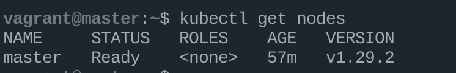
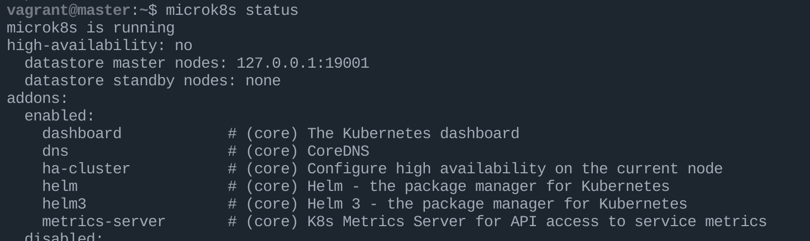
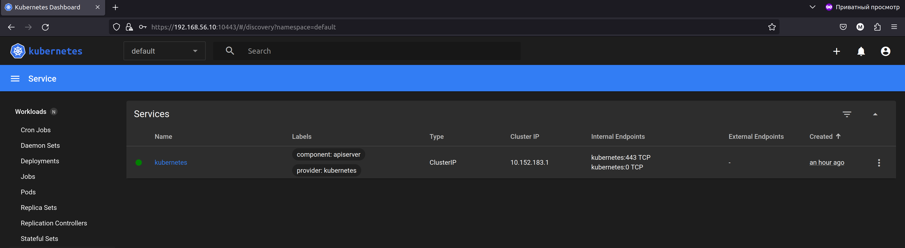

### Команда kubectl
Результат выполнения ансибл роли можно посмотреть [тут](ansible_MicroK8S/result), там есть некоторые выводы для получения информации.
Происходит установка MicroK8S.</br>
Шаги по заданию.
1. ```kubectl get nodes```
 

 2. dashboard - enabled
 
3.
Что-бы попасть в дашборд требуется токен, получил я его такой командой
```shell
kubectl -n kube-system describe secret $(kubectl -n kube-system get secret | awk '/^deployment-controller-token-/{print $1}') | awk '$1=="token:"{print $2}'
```
так же требуется сделать форвардинг, смог его сделать через иакую команда
```shell
microk8s kubectl port-forward -n kube-system service/kubernetes-dashboard 10443:443 --address 0.0.0.0
```
или
```shell
kubectl port-forward -n kube-system service/kubernetes-dashboard 10443:443 --address 0.0.0.0
```
