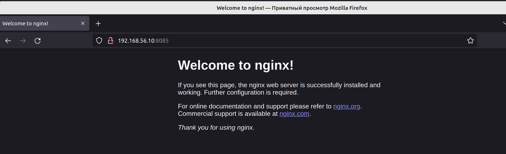
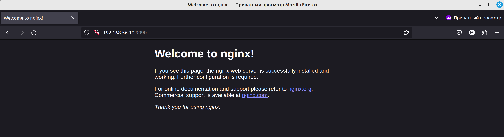

### Базовые объекты K8S

##### 1. Создать Pod с именем hello-world

```sheel
kubectl apply -f manifest/pod.yaml
pod/hello-world created
```

```
kubectl get po
NAME          READY   STATUS             RESTARTS   AGE
hello-world   0/1     ImagePullBackOff   0          66s
```
```shell
kubectl describe pod hello-world -n default
..
Warning  Failed     2m35s (x4 over 4m8s)  kubelet            Failed to pull image "gcr.io/kubernetes-e2e-test-images/echoserver:2.2.": rpc error: code = NotFound desc = failed to pull and unpack image "gcr.io/kubernetes-e2e-test-images/echoserver:2.2.": failed to resolve reference "gcr.io/kubernetes-e2e-test-images/echoserver:2.2.": gcr.io/kubernetes-e2e-test-images/echoserver:2.2.: not found
```
Совершил опечатку!
```
kubectl get po
NAME          READY   STATUS    RESTARTS   AGE
hello-world   1/1     Running   0          5m17s
```
Какой порт используется в поде можно посмотреть с помощью данной команды
```shell
kubectl get pod hello-world --template='{{(index (index .spec.containers 0).ports 0).containerPort}}{{"\n"}}'                                                                   git:master*
80
```
Далее возникли проблемы, подключится к данному поду невозможно. Он не доступен. Тоесть внутри контайнера работает nginx но он не стартует, в логах ниже видны проблемы с запуском. Так что я изменил image на nginx

```shell
kubectl logs hello-world
Generating self-signed cert
Generating a 2048 bit RSA private key
....................+++
...............+++
writing new private key to '/certs/privateKey.key'
-----
Starting nginx
```
а вот логи обычного nginx контейнера
```
 kubectl logs hello-world
/docker-entrypoint.sh: /docker-entrypoint.d/ is not empty, will attempt to perform configuration
/docker-entrypoint.sh: Looking for shell scripts in /docker-entrypoint.d/
/docker-entrypoint.sh: Launching /docker-entrypoint.d/10-listen-on-ipv6-by-default.sh
10-listen-on-ipv6-by-default.sh: info: Getting the checksum of /etc/nginx/conf.d/default.conf
10-listen-on-ipv6-by-default.sh: info: Enabled listen on IPv6 in /etc/nginx/conf.d/default.conf
/docker-entrypoint.sh: Sourcing /docker-entrypoint.d/15-local-resolvers.envsh
/docker-entrypoint.sh: Launching /docker-entrypoint.d/20-envsubst-on-templates.sh
/docker-entrypoint.sh: Launching /docker-entrypoint.d/30-tune-worker-processes.sh
/docker-entrypoint.sh: Configuration complete; ready for start up
2024/03/05 08:30:51 [notice] 1#1: using the "epoll" event method
2024/03/05 08:30:51 [notice] 1#1: nginx/1.25.4 И Далее
```
и curl возращает по IP адресу пода
```
curl 10.1.219.71
<!DOCTYPE html>
<html>
<head>
.....
```
Теперь веб доступен, команда для port-forward

```
 kubectl port-forward pod/hello-world 8085:80 --address 0.0.0.0
Forwarding from 0.0.0.0:8085 -> 80
Handling connection for 8085
```

[manifest](manifest/pod.yaml)

##### 2 Создать Service и подключить его к Pod

Создается по аналогии с подом команда apply

```
kubectl get svc -o wide
NAME           TYPE        CLUSTER-IP      EXTERNAL-IP   PORT(S)   AGE   SELECTOR
kubernetes     ClusterIP   10.152.183.1    <none>        443/TCP   43h   <none>
netology-svc   ClusterIP   10.152.183.73   <none>        80/TCP    33s   app.kubernetes.io/name=netology-web
```
```
kubectl get po -o wide
NAME           READY   STATUS    RESTARTS       AGE     IP            NODE     NOMINATED NODE   READINESS GATES
hello-world    1/1     Running   3 (149m ago)   3h20m   10.1.219.71   master   <none>           <none>
netology-web   1/1     Running   0              84s     10.1.219.72   master   <none>           <none>
```
```
kubectl port-forward service/netology-svc 9090:9090 --address 0.0.0.0
Forwarding from 0.0.0.0:9090 -> 80
Handling connection for 9090
```

Манифесты в директории [тут](manifest)
[Service](manifest/service.yaml)